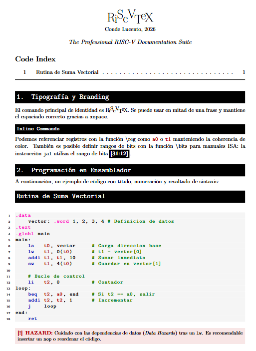

# RiScVTeX — RISC-V Documentation Suite
*by Conde Lucento, 2026*

---

**RiScVTeX** es un paquete de LaTeX diseñado para la documentación profesional de arquitectura de computadores, específicamente para el ISA RISC-V. Permite generar listados de código con resaltado de sintaxis, mapas de memoria dinámicos y diagramas de flujo de instrucciones con una estética técnica y moderna.

**RiScVTeX** is a LaTeX package designed for professional computer architecture documentation, specifically for the RISC-V ISA. It enables the generation of syntax-highlighted code listings, dynamic memory maps, and instruction flow diagrams with a sleek, technical aesthetic.

---

## Características Principales / Key Features

### 🇪🇸 Español
* **Identidad Visual**: Comando `\RiScVTeX` con tipografía dinámica (subidas y bajadas de letras).
* **Resaltado de Sintaxis**: Soporte para instrucciones, registros (x0-x31, a0-a7, etc.) y directivas (`.data`, `.text`).
* **Mapa de Memoria**: Entorno `riscvstack` para visualizar la pila de 32 bits alineada.
* **Índice de Código**: Generación automática de un índice (Code Index) para tus fragmentos de código.
* **Avisos de Hardware**: Comandos para resaltar peligros (`\riscwarn`) y etapas del pipeline.

### 🇺🇸 English
* **Visual Identity**: `\RiScVTeX` command with dynamic typography (bouncing letters).
* **Syntax Highlighting**: Support for instructions, registers (x0-x31, a0-a7, etc.), and directives (`.data`, `.text`).
* **Memory Mapping**: `riscvstack` environment to visualize the aligned 32-bit stack.
* **Code Indexing**: Automatic generation of a Code Index for your snippets.
* **Hardware Alerts**: Specialized commands to highlight hazards (`\riscwarn`) and pipeline stages.

---

## Comandos Rápidos / Quick Commands

| Comando / Command | Descripción / Description |
| :--- | :--- |
| `\RiScVTeX` | Logo oficial con estilo dinámico / Official dynamic logo. |
| `\reg{a0}` | Registro resaltado en rojo / Register highlighted in red. |
| `\bits{31:0}` | Rango de bits en caja negra / Bit range in a black box. |
| `\riscvstep` | Flecha para flujo de pipeline / Pipeline flow arrow. |
| `\riscvsp` | Indicador de Stack Pointer / Stack Pointer indicator. |

---

## Ejemplos / Examples

### Listado de Código / Code Listing
```latex
\begin{riscv}[Suma Simple]
    addi t0, zero, 5  # x5 = 5
    addi t1, zero, 10 # x6 = 10
    add  a0, t0, t1   # a0 = 15
\end{riscv}
```

### Mapa de Memoria / Memory Map
```latex
\begin{riscvstack}[Estado de la Pila]
    \riscvmem{0x7ffffffc}{0x00000001}{Variable x}%
    \riscvmem{0x7ffffff8}{0x00400560}{Retorno ra \riscvsp}%
\end{riscvstack}
```
<div align="center">
  
</div>

## Instalación / Installation
Copia el archivo RiScVTeX.sty en la carpeta de tu proyecto.

Añade \usepackage{RiScVTeX} en tu preámbulo.

¡Empieza a documentar!

Copy the RiScVTeX.sty file into your project folder.

Add \usepackage{RiScVTeX} to your preamble.

Start documenting!

```latex
\usepackage{RiScVTeX}
```
## Licencia / License
Copyright (c) 2026 Conde Lucento. Distribuido bajo la Licencia MIT.
